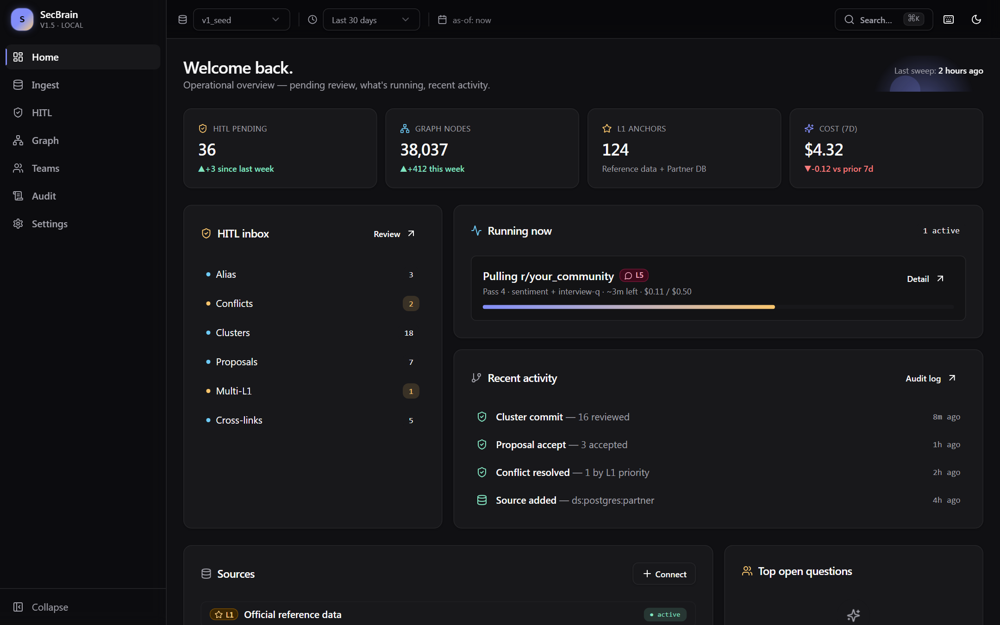
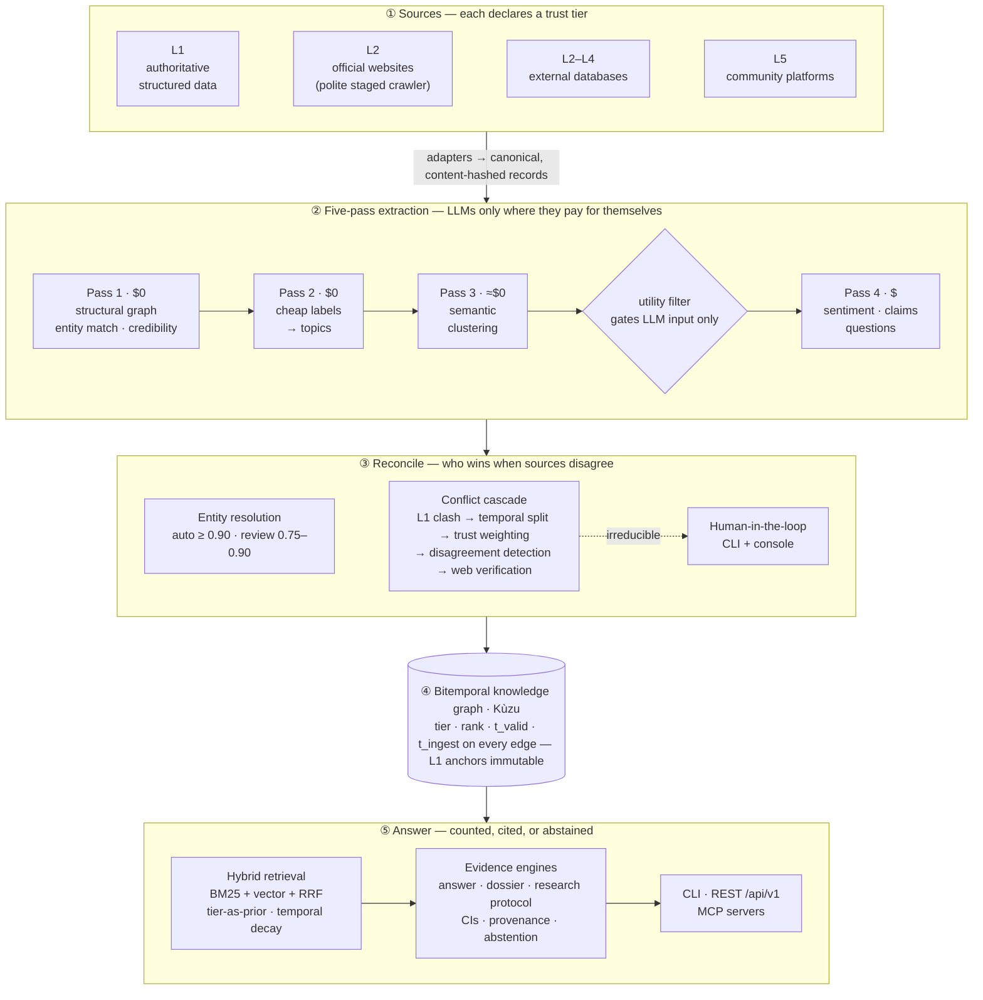
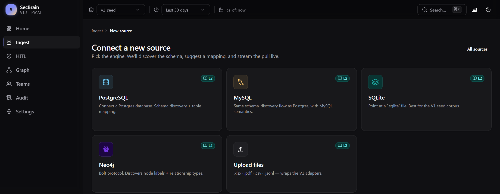

<div align="center">

# SecBrain

### A knowledge-graph engine that knows who to believe.

Point it at the messy places knowledge actually lives — **community forums, Reddit, websites,
internal databases, chat exports** — and get back **counted, cited, confidence-bounded answers**,<br/>
anchored to the sources you trust, with every statistic traceable to the exact records behind it.

[](https://github.com/Mahmoudimahyar/Second_Brain/actions/workflows/ci.yml)
[](LICENSE)


[**Why**](#the-problem) · [**How it works**](#how-it-works) · [**Proven at scale**](#proven-at-scale) · [**Quickstart**](#quickstart) · [**Docs**](#documentation) · [**Bring your own platform**](#bring-your-own-platform) · [**Engineering discipline**](#engineering-discipline)

**Bitemporal, trust-tiered graph** · **multi-vendor LLM gateway** · **statistical answers with provenance**<br/>
**Proven on a 4.5 M-node graph** · **full-corpus LLM extraction for ≈ $150** · **1,235 tests** · **26 ADRs**



<sub>Operations console (Next.js 15). The dashboard tiles above render seeded demo values.</sub>

</div>

---

## The problem

Ask a vector-RAG system a factual question about your community and it will confidently quote a
six-year-old forum comment. Community knowledge — a support forum, a subreddit, a Slack
workspace, a Discord — is enormous, candid and irreplaceable. It is also stale, self-selected
and full of contradictions. Official sources are accurate but narrow. Most systems pick one
side. The ones that mix them have no principled way to decide **who wins when sources
disagree**, or to say **"I don't know."**

SecBrain is an engine for exactly that. You give it heterogeneous sources, each with a declared
**trust tier**. It builds one bitemporal knowledge graph, resolves entities against a canonical
backbone, surfaces and adjudicates conflicts, and answers questions as *measured estimates* —
not vibes.

**No data ships with this repository.** SecBrain is a tool: you bring the sources.

### What people use an engine like this for

| You have… | SecBrain gives you… |
|---|---|
| A product community (forum, subreddit, Discord) + official docs | What users actually struggle with — counted, trended, and checked against what the docs say |
| A company website + internal databases | One queryable graph where the database is ground truth and the website is cross-checked against it |
| Years of support threads or chat exports | The real FAQ, the advice that has gone stale, and the claims that contradict your policy |
| Public discussion about a market | Pain points and demand signals with sample sizes and confidence intervals instead of anecdotes |
| An AI agent that needs grounded context | MCP tools that return tier-ranked, time-aware, cited evidence — and abstain when there isn't any |

## What makes it different

- **Trust tiers are a prior, not a sort order.** Every node and edge carries a tier (L1
  authoritative → L5 community) and a timestamp. Ranking is a calibrated score —
  `tier × rank × temporal decay × author credibility × cross-source consistency` — so a fresh,
  corroborated community claim *can* outrank a stale official one. L1 facts are never
  overwritten; conflicts are flagged on the lower-tier side.
- **Majority ≠ truth.** In a conflict bake-off, the obvious deterministic cascade got **0 of 3**
  "the minority is actually right" cases; a joint-confidence resolver got 3 of 3. Community
  detection here *detects* disagreement — it does not adjudicate it. Minorities are routed to
  web verification, not auto-labelled anomalies.
- **Every answer is an experiment.** A pre-registered denominator, per-bucket estimates with
  thread-clustered confidence intervals and effective sample size, a temporal trend test, a
  cohort split, a robustness check, a stated selection-bias caveat — or an explicit abstention.
- **Provenance down to the statistic.** Each number carries a `stat_id` that resolves to the
  exact records that were counted. Rendering is deterministic and entailment-guarded, so the
  prose cannot drift from the numbers.
- **LLMs only where they pay for themselves.** Five passes; the first three are deterministic
  or local and cost ≈ $0. A reversible utility filter removes the bulk of would-be LLM calls.
  The graph keeps every record — only the LLM's *input* is filtered.
- **Vendor-neutral by construction.** One gateway; importing a vendor SDK anywhere else is a
  lint error.
- **It audits its own claims.** A doc-lint gate fails the build when documentation says
  something is done that the code does not actually wire up.
  ([Why that exists.](#engineering-discipline))

## How it works



**Trust tiers.** L1 authoritative structured data → L2 official websites → L3 structured
non-official → L4 unstructured non-official → L5 community. The tier of an external connector
is *declared by the operator* at connect time; claiming L1 requires explicit confirmation, and
two L1 sources that disagree open a human review item rather than auto-merging.

**Bitemporal edges.** Every edge stores both when a fact was *true* (`t_valid_*`) and when the
graph *learned* it (`t_ingest_*`). Updates are an atomic supersede — close the old interval,
open the new — so `as_of` queries reconstruct what the system believed on any past date.

**Temporal decay by fact type.** A price goes stale in a year; a process in three; a founding
date never. Each edge type carries its own half-life.

**A judge that cannot mark its own homework.** Same-tier ties go to a three-vendor LLM judge
with family exclusion (≥ 2 of 3 must agree). Anything else goes to a human.

**A crawler with manners.** `robots.txt` is honoured with no override; an honest, contactable
user-agent is mandatory (the adapter refuses to start without one); crawl-delay is respected
and clamped; social and forum domains are hard-blocked from the crawl path; the proxy fallback
is opt-in and off by default; spend is capped at three separate enforcement points.

### What an answer looks like

*Illustrative output with made-up numbers — the shape is what the research protocol emits.*

```text
Q: What do users most often struggle with after onboarding?

Estimate · n = 4,000 docs / 3,760 threads / 1,540 authors
  Billing & plan confusion          41%  (95% CI 39–43%, n_eff = 3,598)
  Integrations failing silently     27%  (95% CI 25–29%)
  ...
Classifier-error band on the top bucket: 36–48%  (sensitivity analysis; NOT human-gold-calibrated)
Temporal: increasing, slope +0.02/yr
By cohort: new users 58% · power users 19%
Robustness: top bucket stable under threshold perturbation
Bias: posters are a self-selected, vocal subset — read proportions as directional.
Provenance: every bucket's stat_id resolves to its exact source ids.
```

When evidence is thin, the answer is an abstention with the reason — not a guess.

## Proven at scale

The engine has been run end-to-end on a private multi-million-document community corpus
reconciled against official reference data. The corpus and everything derived from it stay
private; these are the engineering numbers:

| | |
|---|---|
| **Graph** | **4.56 M nodes · 13.1 M edges** in embedded Kùzu |
| **Documents** | 3.3 M (posts + comments), thread-complete, FTS5-indexed in under a minute |
| **LLM extraction over every post** | **≈ $119**, 15.6 h, one failed record |
| **LLM extraction over 1.95 M comments** | **≈ $34** — the utility gate eliminated 93 % of calls |
| **Semantic clustering, full corpus** | < $0.01 |
| **Warm semantic query** | 34 ms over ~877 K persisted vectors |
| **Graph compaction** | 182 GB → 5.3 GB |

**Decisions were made by bake-off, and recorded** — each of these has an ADR that states its
sample size and caveats:

| Question | Outcome | ADR |
|---|---|---|
| Which graph store? | Neo4j 0.600 · **Kùzu 0.564** · Postgres-AGE 0.528 on real data; margin < 0.10 → ops-complexity tiebreak → Kùzu | [001](docs/11-decisions/ADR-001-graph-db.md) |
| Custom pipeline or an off-the-shelf GraphRAG engine? | Keep custom — point lookups 0.21 ms vs 3.28 ms; both far inside budget | [025](docs/11-decisions/ADR-025-graphrag-engine-evaluation-spike.md) |
| NER and embedder for entity resolution? | **NuNER-Zero** (P 0.99 vs 0.64 for fuzzy match) · **Qwen3-Embedding-0.6B** (R@1 0.78 vs 0.74) — small gold sets, labelled "optimistic" | [022](docs/11-decisions/ADR-022-entity-resolution-modernization.md) |
| Deterministic cascade or joint confidence for conflicts? | Joint: accuracy 0.88 vs 0.38, minority-correct recall 1.00 vs 0.00 (8 seeded cases) → shipped as an L1-anchored hybrid, default off | [026](docs/11-decisions/ADR-026-truth-discovery-evaluation-spike.md) |
| Which models, for which task? | Benchmark-driven per-task routing behind the gateway; open-weights models won bulk extraction on cost × quality | [003](docs/11-decisions/ADR-003-extraction-stack.md) · [023](docs/11-decisions/ADR-023-calibrated-cascade-and-router.md) |

**And where it is weak** — the numbers that do not flatter:

- The bulk sentiment classifier agrees only moderately with a stronger reference labeller
  (**κ = 0.36**, n = 320). The engine surfaces that as a low-reliability flag on affected
  answers instead of hiding it.
- Two of ten research-protocol criteria are gated on human gold labels that do not exist yet.
  They are reported as a known ceiling, not counted as passes.
- Line coverage is **72 %** against a project target of 80 %. `ruff` (full rule set) and
  `mypy --strict` are configured but not yet clean; CI runs them as a visible ratchet.
- Several capabilities are **Built but not Validated** on real data — the external-database
  connectors, cross-graph entity mapping, the feedback loop. The console's graph canvas is
  still a stub.

## Quickstart

Requires Python ≥ 3.12. **No API keys, no data and no GPU are needed** for any of this.

```bash
git clone https://github.com/Mahmoudimahyar/Second_Brain.git
cd Second_Brain
python -m venv .venv && source .venv/bin/activate      # Windows: .venv\Scripts\activate
pip install -e ".[dev]"
pytest                                                 # the full suite, about a minute
```

### See it work in two minutes

The [quickstart](examples/quickstart/README.md) generates a tiny, entirely fictional world — an
"official" spreadsheet and a community forum that half-remembers it — and runs the real CLI on it:

```bash
python examples/quickstart/make_demo_data.py demo/in
secbrain --data-dir demo/data ingest l1-adea   demo/in/reference_2024-25.xlsx          # the source you trust
secbrain --data-dir demo/data ingest l5-reddit demo/in/demo_forum.jsonl demo/in/demo_forum_comments.jsonl
secbrain --data-dir demo/data canonical "Lakemont"            # nickname → canonical entity (+ derived alias "LCDM")
secbrain --data-dir demo/data query "Marlowe" --no-hybrid     # official facts first, community after, all cited
python examples/quickstart/conflict_cascade.py                # what happens when sources disagree
```

```text
A forum post repeats an old number; the official sheet disagrees
  → l1_clash_invalidated   winner: official:2025        official beats forum — and the forum claim is flagged, not deleted
Two community claims about DIFFERENT years
  → temporal_split         winner: forum:c04            different years are not a conflict
Same year, same tier — but one author has a far better track record
  → trust_weighted         winner: forum:veteran        track record breaks ties
Same year, same tier, equally credible authors, and no judge available
  → hitl_pending           winner: —                    real ambiguity goes to a person, not a guess
```

That is the production `ConflictResolver` at work (output abridged, with a comment on the right;
the [quickstart](examples/quickstart/README.md) shows it verbatim). A test replays the whole
walkthrough in CI, so it cannot quietly stop being true.

### More to try

```bash
secbrain-doc-lint      # the docs-vs-code truth gate
graphrag-index --full  # index THIS repo's docs ↔ code ↔ tests into a graph (~30 s, no keys) …
graphrag-mcp           # … and serve it to a coding agent: search_codebase, get_related_tests, find_stale_docs, …
```

`.mcp.json` already registers both MCP servers for MCP-aware clients such as Claude Code.

**Run the operations console** (Node ≥ 22, pnpm ≥ 11):

```bash
cd web && pnpm install && cd ..
secbrain ui            # FastAPI on :8000 + Next.js on :3000
```

<div align="center">

</div>

## Documentation

| | |
|---|---|
| **[Quickstart](examples/quickstart/README.md)** | The whole idea in two minutes, on fictional data |
| **[Concepts](docs/guide/concepts.md)** | Trust tiers · bitemporal edges · five passes · entity resolution · the conflict cascade · evidence-grade answers |
| **[Architecture tour](docs/guide/architecture.md)** | Which package does what, and which tests guard it |
| **[Bring your own platform](docs/guide/adapters.md)** | What exists, and what adding Slack or Discord honestly takes |
| **[MCP for AI agents](docs/guide/mcp.md)** · **[Configuration](docs/guide/configuration.md)** · **[FAQ](docs/guide/faq.md)** | |
| **[CLI reference](docs/guide/reference/cli.md)** · **[REST reference](docs/guide/reference/rest-api.md)** | *Generated from the code*; a test fails if they go stale |
| **[Design record](docs/README.md)** | 26 ADRs, per-slice feature packets, research notes, the gap register |

## Bring your own platform

Connectors that exist today:

| Source | How |
|---|---|
| **Reddit-style dumps** (posts + comments, JSONL) | `secbrain ingest l5-reddit` — or `l5-reddit-batched` for resumable, checkpointed ingests |
| **Threaded forum dumps** (JSONL) | `secbrain ingest l5-sdn` |
| **Websites** | `secbrain crawl register …` — staged crawler: sitemap → entity-tagged → full GraphRAG, with budgets |
| **HTML · PDF · spreadsheets** | `secbrain ingest l2-html` · `l1-pdf` · `l1-adea` |
| **PostgreSQL · MySQL · SQLite · Neo4j** | Console → *Connect a new source*: schema discovery → suggested table-to-graph mapping → delta pulls |

**Slack, Discord, Discourse, Zendesk, your own API?** Not built yet, and not claimed. Adding a
threaded platform is a few hundred lines — an adapter that turns an export into post / reply /
author records, a structural-assembly method, a credibility rubric and a CLI command — because
everything *after* that (topics, clustering, extraction, entity resolution, the conflict cascade,
retrieval, provenance, the console) operates on the graph, not on the source. The
[adapter guide](docs/guide/adapters.md) walks through Slack step by step, with honest sizes.

The core engine does not know what domain it is working in; domain knowledge lives in the
adapters and in the canonical entity list you load as L1. (Bundled adapters and test fixtures
come from the first deployment, an education-admissions community, which is why you will see
school names in examples.) LLM passes need keys — copy [`.env.example`](.env.example) to `.env`;
it lists exactly the variables the code reads, and a test keeps it that way. On a large graph,
cap Kùzu's buffer pool (`SECBRAIN_KUZU_BUFFER_POOL_BYTES`) or it will take most of your RAM.

> **Your sources, your responsibility.** Respect the terms of service, licences and privacy
> law that apply to anything you ingest. SecBrain's crawler is deliberately conservative, but
> the engine cannot know what you are allowed to collect.

## Interfaces

| Surface | Entry point | Notes |
|---|---|---|
| **CLI** | `secbrain` → [`src/cli.py`](src/cli.py) | 27 commands: ingest (9 source types), extract, cluster, resolve, query, ask, hitl, crawl, ui |
| **REST API** | [`src/web/`](src/web/) · FastAPI · `/api/v1` | 48 operations: ask, evidence, dossier, graph views, HITL, sources, crawler, audit, settings |
| **Console** | [`web/`](web/) · Next.js 15 · React 19 · Tailwind 4 | 41 pages; Playwright + axe-core accessibility checks |
| **Engine MCP server** | `secbrain-mcp` | `query_graph` (tier-filtered, bitemporal `as_of`), `get_canonical_entity`, connector tools |
| **Repo-context MCP server** | `graphrag-mcp` | 11 tools over this repository's docs ↔ code ↔ tests graph |
| **Scheduled flows** | [`flows/`](flows/) · Prefect 3 | the five passes, per-source delta pulls, crawler dispatcher + worker |

## Engineering discipline

This is the part of the project I would most want a reviewer to read.

Midway through, a self-audit found that several capabilities documented as "Locked" —
temporal-decay ranking, hybrid retrieval, the three-vendor judge, bitemporal supersede — had
passing unit tests and **were never called from a real entrypoint**. One accepted ADR listed
"related code" files that did not exist. The write-up is
[`why-drift-happened.md`](docs/00-bootstrap/why-drift-happened.md); it names six root causes,
including one squashed 764-file commit that nobody could review.

What changed, and is still enforced:

| Guardrail | Mechanism |
|---|---|
| **Four-state status vocabulary** — `Decided → Built → Wired → Validated` | "Locked" and ADR-`accepted` mean *Decided* only. Nothing is done below *Wired*. |
| **The Wiring Gate** | A capability is done when a **non-test call site** in the CLI, a flow, or an API route invokes it — cited as `file:line`. Stub wiring (`None` collaborators) counts as a gap. |
| **One source of truth** | [`implementation-status.md`](docs/00-bootstrap/implementation-status.md). If any other doc disagrees, the status file wins and the other doc is the bug. |
| **Doc-lint in the test suite** | [`tools/doc_lint`](tools/doc_lint/) fails the build if an accepted ADR names a missing file, a doc claims "Locked" below *Wired*, or the resolver is constructed without its judge. |
| **No horizontal expansion before vertical validation** | No new feature area while the core slice is below *Validated* on real data. |
| **Small diffs** | One slice per commit; never squash a body of work into one unreviewable change. |
| **Research must be live-verified** | An ADR cannot be `accepted` while a load-bearing citation is unverified. |

Also in the repo: **26 ADRs** ([`docs/11-decisions/`](docs/11-decisions/)), per-slice **feature
packets** (requirements · API · data · state machine · test plan · known issues), and a
[gap register](docs/00-bootstrap/gap-register.md) that keeps the unflattering entries too.

> This public repository is a curated snapshot of a private development repository. Validation
> reports, corpus-operations tooling and run outputs that docs refer to as `.agent/reports/…`,
> `cloud/…` or `scripts/…` are tied to a private corpus and are intentionally not published.

### Built with coding agents, on a leash

Much of this code was written with AI coding agents. The interesting part is not that an agent
wrote code — it is the harness that made the output trustworthy: [`AGENTS.md`](AGENTS.md)
(operating rules, repair budgets, human-approval boundaries), a skill and role library under
[`PROMPTS/`](PROMPTS/), and the **repo-level GraphRAG MCP server**
([`tools/graphrag/`](tools/graphrag/)) that lets an agent ask *"which tests cover this
feature?"* or *"which docs are stale relative to this code?"* instead of reading everything.
The drift post-mortem above is what happens when that harness has a hole; the gates are the
patch.

## Repository layout

```text
src/        the engine — ingestion · extraction · er · conflict · graph · retrieval · research · gateway · web
flows/      Prefect 3 flows wrapping the same functions the CLI calls
tools/      graphrag/ (repo-context MCP server) · doc_lint/ (truth gate) · bake_off/ (graph-DB harness)
web/        Next.js operations console
examples/   the two-minute quickstart on fictional data (replayed by a test)
evals/      offline eval harnesses and synthetic gold sets
tests/      1,235 tests, organised by domain
docs/       numbered documentation tree — start at docs/README.md
PROMPTS/    skill + role library the coding agents are dispatched through
```

## Tech stack

**Engine** Python 3.12 · Pydantic 2 · Typer · structlog · **Kùzu** (embedded graph) · SQLite
(side store, audit log, FTS5) · rapidfuzz · scikit-learn · NumPy<br/>
**Models** Anthropic · OpenAI · Google · open-weights via OpenAI-compatible endpoints, all behind
one gateway · local BGE / Qwen3 embeddings · NuNER-Zero · Tavily for web verification<br/>
**Orchestration & serving** Prefect 3 · FastAPI · Model Context Protocol SDK · crawl4ai<br/>
**Console** Next.js 15 · React 19 · TypeScript · Tailwind 4 · shadcn/Radix · TanStack Query ·
Sigma.js · visx<br/>
**Quality** pytest · Hypothesis · respx · ruff (with architectural import bans) · mypy strict ·
Vitest · Playwright · axe-core · GitHub Actions

## Data and privacy

- **This repository contains code and documentation only** — no corpus, no graph, no
  embeddings, no run outputs. Test fixtures and eval gold sets are synthetic or hand-written;
  [`evals/README.md`](evals/README.md) explains how a gold set can reflect real-world spellings
  without publishing anyone's words.
- **Statistics from community sources are directional.** Posters are a self-selected, vocal
  subset; the engine states that on every answer rather than leaving it to the reader.
- Code and docs are licensed [Apache-2.0](LICENSE); see [`NOTICE`](NOTICE) for what that does
  not cover.

Found something here that looks like personal data or a credential? Please report it privately —
see [`SECURITY.md`](SECURITY.md).

## Status and roadmap

Pre-1.0 research software, single-tenant and local-first by design — it is **not** hardened for
multi-tenant or internet-facing deployment ([security model](docs/12-security/security-model.md)).
Near-term: first-party Slack / Discord / Discourse adapters, validate the Built-but-unvalidated
connectors, human gold labels to un-gate calibration, finish the WebGL graph canvas, and drive
the lint/type ratchets to zero. History is in the [changelog](CHANGELOG.md); direction in the
[roadmap](docs/02-product/roadmap.md).

## Contributing · Citing · Author

Contributions are welcome — read [`CONTRIBUTING.md`](CONTRIBUTING.md) first; the bar is
*small, evidenced, wired*. To cite the project, use [`CITATION.cff`](CITATION.cff) (GitHub's
"Cite this repository" button).

Built by **[Mahyar Mahmoudi](https://github.com/Mahmoudimahyar)**.
